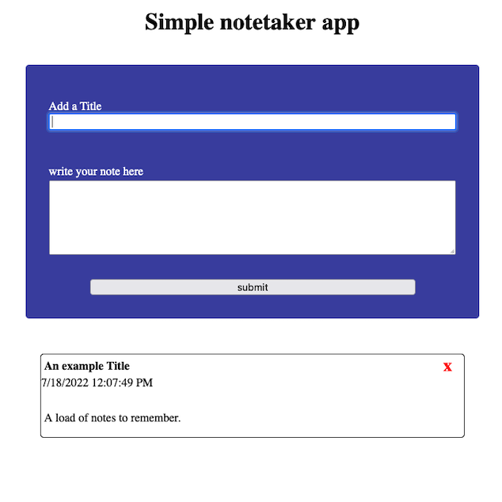
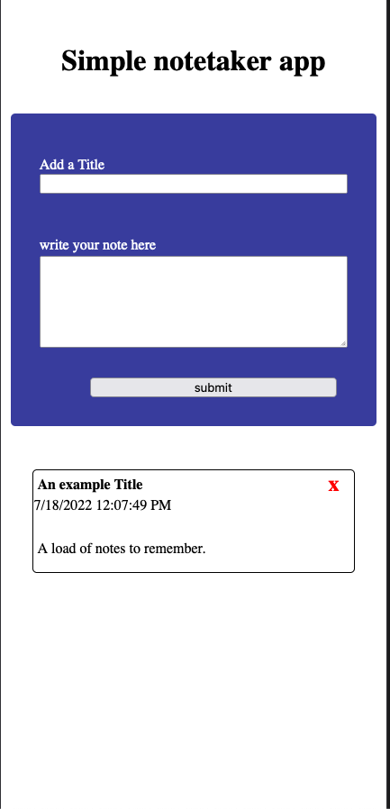

# A simple Note taking App

## Table of contents

- [Overview](#overview)
  - [The challenge](#the-challenge)
  - [Screenshot](#screenshot)
  - [Links](#links)
- [My process](#my-process)
  - [Built with](#built-with)
  - [What I learned](#what-i-learned)
  - [Continued development](#continued-development)

## Overview

This idea was based of Andy Sterks a youtuber who also taught himself how to code. I took his orginal idea and tweaked it slightly to make my own version. It is a simple front end note taking app, that allows users to write a note title, and note and it sets the date and time of when the note was made.

### What I Found Challenging

This was my first project using callbacks independently of any tutorial and also taking advantage of closure in programming. I learnt a great deal of how data is passed around in JavaScript, and the problems I was facing was often because I didn't clearly point the program to the data it needed to perform an action I had asked it to do. I also tried to follow the concept of using pure functions and make functions only rely on what data was passed to them.

### Screenshot




### Links

- Solution URL: [Add solution URL here](https://github.com/zach7815/SimpleNoteTaker)
- Live Site URL: [Add live site URL here](https://zach7815.github.io/SimpleNoteTaker/)

## My process

My process for this project was to try and keep the functions in the script pure. I also sought to use callbacks and closures to help keep the code as clean as possible. This projects main focus was on me learning JavaScript and getting it to work, hence the CSS of this project is very simple.

### Built with

- Semantic HTML5 markup
- Flexbox
- JavaScript

### What I learned

In this project I gained a greater understanding of how JavaScript works and concepts such as closure and why it is useful. I also put into practise the use of Pure Functions to make the code more robust and easier to read and understand.

For the Javascript:

example of a pure function I created for the project.

```js
function appendNote(note, noteTitle, noteContent, noteDate, deleteNoteBtn) {
  note.appendChild(noteTitle);
  note.appendChild(noteDate);
  note.appendChild(deleteNoteBtn);
  note.appendChild(noteContent);
  notesContainer.appendChild(note);
  noteForm.reset();
}
```

### Continued development

For my continued developement, I believe the next projects I need to be working on are full stack web applications using Node JS and frameworks such as Express JS. Then I will need to work on implementing databases so that projects like this can save the users notes.
